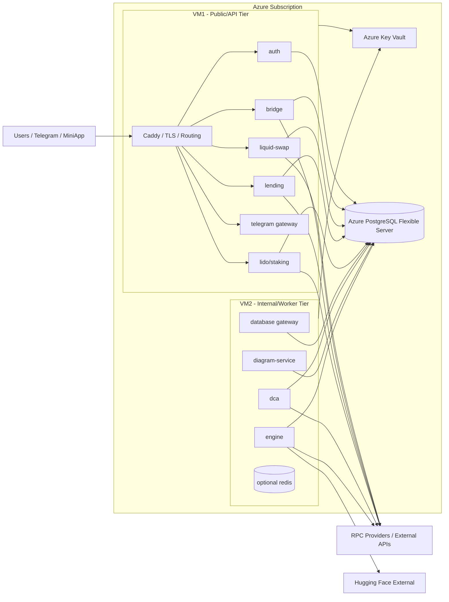
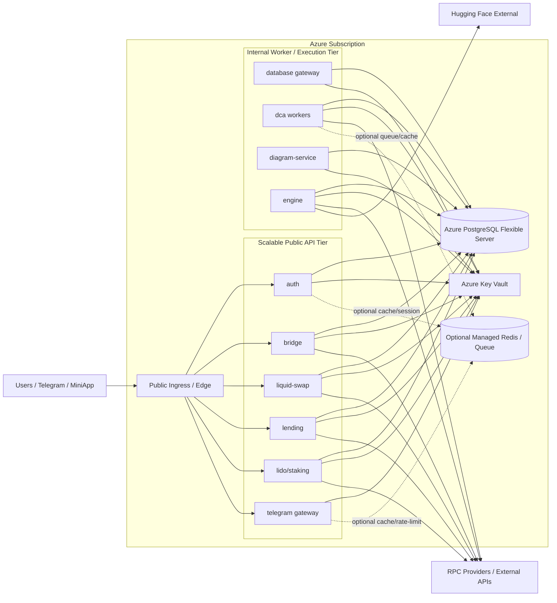

# Panorama Azure Backend Architecture Decision Memo

## 1. Executive Summary

Panorama is deciding between keeping a low-cost Azure VM baseline, returning selectively to Azure Container Apps, or moving more broadly back to managed container infrastructure. The decision matters because the project is still startup-stage, cost-sensitive, and running under limited Azure credits, but it also needs a realistic path to future growth.

The previous Container Apps direction solved some scaling concerns but introduced a higher fixed-cost profile for a multi-service backend where several services needed to stay warm. The current architecture direction starts from a 2-VM baseline with managed PostgreSQL and Key Vault, aiming to control monthly spend while keeping operational complexity acceptable for a small team.

Based on the current cost evidence, the broader Azure Container Apps estimate is materially higher than the present VM-based baseline. The recommendation is therefore **not** to return fully to Container Apps now. The best tradeoff for the current stage is a **phased hybrid architecture** built from the **2-VM baseline**, keeping stateful core services managed and only using Container Apps selectively later if specific services prove bursty or require independent scaling.

## 2. Current State

### Current Architecture Direction

The backend is being reasoned from a **2-VM baseline**:

- **VM1**: public and mostly stateless API traffic
- **VM2**: internal, heavier, and worker-oriented workloads
- **Azure Database for PostgreSQL Flexible Server**: preferred managed relational datastore
- **Azure Key Vault**: preferred secret source of truth

### Main Services In Scope

Public/API-facing services:

- `auth`
- `bridge`
- `liquid-swap`
- `lending`
- `lido/staking`
- `telegram gateway`

Internal/heavier services:

- `database gateway`
- `dca`
- `diagram-service`
- `engine`
- optional `redis`

### Current Cost Baseline

Current Azure Cost Management view indicates:

- **Current accumulated cost**: about **$55.84**
- **Forecast monthly cost**: about **$95.76**

Main visible cost drivers from the current screenshot:

- Virtual Machines: about **$27.81**
- Azure Database for PostgreSQL: about **$20.57**
- Storage: about **$4.80**
- Virtual Network: about **$2.41**
- Azure DNS: about **$0.23**
- Key Vault: negligible at current scale

### Image Placeholder 1

![Current Azure Cost Baseline - insert image here]

Caption: Azure Cost Management screenshot showing the current monthly cost baseline and forecast.

## 3. Decision Drivers

### Primary Decision Drivers

- **Cost sensitivity**: the architecture must remain viable for a startup with constrained credits and low tolerance for unnecessary fixed spend.
- **Operational simplicity**: the team should avoid a platform that requires disproportionate engineering time to operate.
- **Startup-grade resilience**: the system does not need enterprise-grade HA yet, but it must still be production-credible.
- **Future scaling path**: the architecture must allow selective evolution without a full re-platform.
- **Pragmatic use of managed services**: managed services should be used where they clearly reduce risk or operator burden.
- **Avoiding a full ACA return**: the design should not simply reintroduce the previous Container Apps model at a higher cost.

### What “Good” Looks Like

A good architecture for this stage is:

- low fixed monthly cost
- simple to deploy and operate
- resilient enough for a startup product
- explicit about single points of failure
- avoids false economies around stateful services
- allows selective extraction of services later if growth justifies it

## 4. Options Compared

| Option | Summary | Estimated monthly cost level | Operational complexity | Scaling capability | Primary risks |
|---|---|---:|---:|---|---|
| **A. Pure 2-VM architecture** | All backend services on 2 VMs; minimal managed services beyond DB/Key Vault | Low | Medium | Mostly vertical; limited horizontal scaling | VM saturation, noisy neighbors, shared deployment blast radius |
| **B. 2 VMs + managed core services** | 2 VMs for runtime, managed PostgreSQL, Key Vault, lightweight networking | Low-Medium | Medium | Good near-term, selective horizontal scaling later | Public/internal coupling remains unless split carefully |
| **C. 2 VMs + selective ACA** | Keep VM baseline; move only a few stateless/bursty services to Container Apps | Medium | Medium | Better per-service scaling where needed | Platform fragmentation if overused |
| **D. Broader ACA rollout** | Put many or most services into ACA with always-on replicas | High | Medium | Strong per-service scaling | Higher fixed cost, many warm replicas erode ACA efficiency |
| **E. Future ideal growth-stage architecture** | Hybrid architecture with managed state, split worker/public tiers, selective autoscaling | Medium-High | Medium-High | Strongest long-term path | More moving parts; unjustified too early |

### Interpretation

- **Option A** is the cheapest runtime model, but it becomes fragile if too much state or too many background workloads are concentrated on VMs.
- **Option B** is the best current fit because it preserves cost discipline while still offloading the riskiest stateful responsibilities.
- **Option C** is a valid future move only if one or two services prove to have independent scaling needs.
- **Option D** is currently unattractive because many always-on replicas make ACA cost more like fixed infrastructure than serverless.
- **Option E** should be treated as a future target, not a present requirement.

## 5. Cost Comparison

### Cost Summary

| Scenario | Estimated monthly cost | Notes |
|---|---:|---|
| **Current VM-based baseline** | **~$95.76 forecast** | Based on current Azure Cost Management forecast |
| **Broader ACA estimate** | **~$241.05** | Based on Azure Pricing Calculator with multiple always-on services |
| **Delta** | **~$145.29 more than current baseline** | ACA estimate is materially higher than current direction |

### ACA Estimate Components Visible in Current Calculator

| Component | Approximate monthly cost |
|---|---:|
| Azure Database for PostgreSQL | $130.52 |
| Storage Accounts | $21.84 |
| ACA `telegram` | $9.86 |
| ACA `auth` | $9.86 |
| ACA `lido/staking` | $9.86 |
| ACA `bridge` | $11.83 |
| ACA `lending` | $11.83 |
| ACA `database gateway` | $11.83 |
| ACA `liquid-swap` | $23.65 |

### Key Cost Drivers

- PostgreSQL remains a major cost driver in all realistic Azure scenarios.
- Storage is non-trivial and should not be ignored in comparisons.
- In ACA, the main runtime cost driver is **always-on replicas**, not request count.
- CPU and memory reservations matter more than low request volumes when services must stay warm.
- Several small always-on ACA services combine into a meaningful fixed monthly bill.

### Image Placeholder 2

![Azure Pricing Calculator Estimate - insert image here]

Caption: Azure Pricing Calculator screenshot showing the broader Azure Container Apps estimate.

### Cost Interpretation

- **Requests are not the primary cost driver** in the current ACA estimate.
- **Always-on instances, CPU, and memory dominate ACA cost** when `minReplicas = 1`.
- ACA is financially attractive when services can scale down aggressively. It becomes much less attractive when many services must stay warm at all times.
- The broader ACA estimate therefore does **not** support a full return to Container Apps for Panorama at the current stage.

## 6. Service Placement Recommendation

| Service | Recommended placement now | Future placement later | Rationale |
|---|---|---|---|
| `auth` | VM1 | ACA or separate public compute tier | Stateless, public, low compute, good future autoscaling candidate |
| `bridge` | VM1 | ACA or separate public compute tier | Public orchestration service with moderate traffic sensitivity |
| `liquid-swap` | VM1 | Separate VM or ACA later | Public API with higher provider-call and burst risk |
| `lending` | VM1 | Separate service later | Public yield API, moderate compute and dependency fan-out |
| `lido/staking` | VM1 | Separate service later | Public API, lighter than swap, can stay co-located initially |
| `telegram gateway` | VM1 or dedicated tiny edge VM | ACA or dedicated edge runtime later | Bursty ingress candidate with independent failure-domain value |
| `database gateway` | VM2 | Separate internal service later | Internal data-facing service; should not sit in the public tier |
| `dca` | VM2 | Dedicated worker runtime later | Scheduling and execution behavior makes it a poor early ACA candidate |
| `diagram-service` | VM2 | Separate worker or burst compute later | Likely heavier or burstier than public APIs |
| `engine` | VM2 | Dedicated internal runtime later | Operationally sensitive, not a first ACA move |
| `redis` | VM2 only if still required | Remove or replace selectively later | Acceptable as transitionary cache/compat layer, not ideal as durable core state |
| `PostgreSQL` | Managed Azure PostgreSQL | Managed Azure PostgreSQL | Worth paying for as a managed service from day one |
| `Key Vault` | Managed Azure Key Vault | Managed Azure Key Vault | Worth paying for as the default secret source of truth |

## 7. Recommended Target Architecture

### Recommended Shape

The recommended target architecture for the current stage is:

- **VM1** for public, mostly stateless APIs
- **VM2** for internal, heavier, and worker-oriented services
- **Managed PostgreSQL** for primary relational data
- **Key Vault** for secrets
- **No broad ACA return now**
- **Selective future ACA use only where justified by traffic shape or deployment needs**

### Why This Is The Best Current Tradeoff

- It keeps the monthly bill materially closer to the current baseline.
- It avoids overpaying for many always-on Container Apps.
- It keeps risky state off self-hosted infrastructure.
- It reduces platform complexity compared with a broad per-service managed container rollout.
- It preserves a clean path to future service extraction because services remain containerized.

### Recommended Mermaid Diagram

## 8. Ideal Future Architecture

### Purpose

The recommended architecture above is the best current tradeoff. The ideal future architecture is included separately to show the intended long-term direction once traffic, reliability expectations, and team capacity justify more separation and managed scaling.

This future design should be treated as a **target state**, not as an immediate build requirement.

### Ideal Future Shape

- public ingress separated from internal workloads
- stateless public APIs independently scalable
- worker and execution workloads isolated from public request traffic
- managed PostgreSQL retained as the system of record
- Key Vault retained as the secret source of truth
- optional managed cache or queue introduced only if the workload proves it is necessary
- selective use of Azure Container Apps for stateless or bursty services

### Why This Is The Ideal Direction

- It improves fault isolation between edge traffic, public APIs, and workers.
- It allows scaling the services that actually need elasticity without moving everything to a heavier platform.
- It avoids premature AKS complexity while still moving toward a cleaner long-term service topology.
- It provides a clearer operational model for future growth, team expansion, and higher uptime expectations.

### Ideal Future Mermaid Diagram

### Draw.io Azure Icon Diagram Spec

Use this spec to rebuild the ideal future diagram with Azure icons in draw.io.

#### Main Layout

- Left-to-right flow
- One outer boundary for **Azure Subscription**
- Top/front layer for **public ingress**
- Middle layer for **public scalable services**
- Lower layer for **internal worker/execution services**
- Right-side shared managed services for **PostgreSQL**, **Key Vault**, and optional **Redis/queue**

#### Azure Groups

Place these visual groups:

1. **Public Edge**
   - Azure Front Door or Application Gateway icon
   - label: `Public Ingress / Edge`

2. **Public API Tier**
   - use Azure Container Apps icons for:
     - `auth`
     - `bridge`
     - `liquid-swap`
     - `lending`
     - `lido/staking`
     - `telegram gateway`
   - group label: `Scalable Public API Tier`

3. **Worker / Internal Tier**
   - use Azure Container Apps icons or generic container/compute icons for:
     - `database gateway`
     - `dca workers`
     - `diagram-service`
     - `engine`
   - group label: `Internal Worker / Execution Tier`

4. **Managed Data / Secrets**
   - Azure Database for PostgreSQL icon
   - Azure Key Vault icon
   - optional Azure Cache for Redis icon or a generic queue/cache icon

#### Connections

- `Users / Telegram / MiniApp` -> `Public Ingress / Edge`
- `Public Ingress / Edge` -> every public API service
- every service that persists application data -> `Azure PostgreSQL Flexible Server`
- every service -> `Azure Key Vault`
- public services with external protocol/API calls -> `RPC Providers / External APIs`
- `engine` -> `Hugging Face External`
- optional dotted lines from `auth`, `telegram gateway`, and `dca workers` to `Managed Redis / Queue`

#### Styling Guidance

- Use solid arrows for primary request and data flows
- Use dotted arrows for optional cache or future-state dependencies
- Keep PostgreSQL and Key Vault visually central as shared platform services
- Keep public-facing services above worker services to reinforce tier separation
- Do not place all services in one flat group; the main message is the separation between edge, public APIs, and workers

## 9. Phased Roadmap

### Phase 1: Deploy Now

**Architecture summary**

- Keep the 2-VM baseline
- Keep PostgreSQL managed
- Keep Key Vault managed
- Do not return fully to ACA

**Expected tradeoffs**

- Lowest practical cost for the current stage
- Acceptable operational simplicity
- Clear single points of failure remain

**Concrete migration steps**

1. Finalize the public/internal service split across VM1 and VM2.
2. Keep all secrets in Key Vault.
3. Keep PostgreSQL private and managed.
4. Keep Redis optional and transitional only.
5. Add basic health checks, logs, and rollback steps.

**Triggers to move to Phase 2**

- sustained VM CPU or memory pressure
- webhook instability
- DCA lag or missed schedules
- deployments becoming risky due to shared-host blast radius

### Phase 2: Evolve At Moderate Growth

**Architecture summary**

- Keep the VM baseline
- Extract only the first proven hotspot

**Expected tradeoffs**

- Slightly higher complexity
- Better isolation for one or two services

**Concrete migration steps**

1. Consider moving `telegram gateway` to a dedicated edge runtime if webhook traffic needs isolation.
2. Consider separating `liquid-swap` if it becomes the first noisy public service.
3. Reduce Redis dependence further.
4. Add lightweight monitoring and alerting around latency, resource pressure, and worker lag.

**Triggers to move to Phase 3**

- clear need for independent scaling across multiple services
- higher uptime expectations
- more frequent deployments by a larger team

### Phase 3: Evolve For Stronger Scale And Reliability

**Architecture summary**

- Preserve managed state
- separate public stateless workloads from worker-heavy workloads more explicitly
- introduce selective autoscaling where the business case is proven

**Expected tradeoffs**

- Higher monthly cost
- More moving parts
- Stronger scaling and fault isolation

**Concrete migration steps**

1. Extract selected stateless public services to ACA or equivalent managed runtime.
2. Add a dedicated worker runtime for heavy background services.
3. Introduce managed cache or queue only if it solves a measured problem.
4. Revisit ingress, observability, and service boundaries based on real traffic and failure data.

## 10. Final Recommendation

### Decision

Panorama should **not return fully to Azure Container Apps now**.

The recommended current architecture is:

- **2-VM hybrid baseline**
- **managed PostgreSQL**
- **managed Key Vault**
- **selective ACA use later only if justified by real service behavior**

### Why

- The broader ACA estimate is materially above the current VM-based baseline.
- Most of the ACA cost increase comes from keeping multiple services always on.
- The VM baseline is still good enough for startup-stage scale if state is handled sensibly.
- Managed PostgreSQL and Key Vault are worth paying for; broad always-on ACA is not currently justified.

### What To Avoid

- self-hosting PostgreSQL to save a modest amount while taking on disproportionate risk
- broad ACA rollout for many services with `minReplicas = 1`
- letting Redis become critical long-term state without an explicit decision
- overengineering toward a growth profile that the product has not reached yet

## 11. Open Questions And ADR

### Open Questions / Assumptions

- Current Azure Cost Management forecast remains representative for near-term usage.
- The ACA calculator scenario is intended as a broad comparison, not a finely optimized selective ACA design.
- Traffic remains startup-scale, not sustained high-volume production traffic.
- Single-region operation is acceptable for now.
- A 2-VM split is operationally acceptable for the current team.

### ADR

#### Context

Panorama needs an Azure backend architecture that remains cost-aware, production-credible, and realistic for a small team. The platform must balance near-term spend with future scalability while avoiding a full return to a costlier broad ACA model.

#### Decision

Adopt a **2-VM hybrid Azure architecture** as the current target. Keep **Azure Database for PostgreSQL Flexible Server** and **Azure Key Vault** as managed services. Do **not** move broadly back to Azure Container Apps now. Revisit selective ACA adoption only for proven stateless or bursty services later.

#### Consequences

- Lower near-term monthly cost than a broad ACA rollout
- Simpler operational model than many always-on managed container services
- Accepts some single-host and single-tier risk in exchange for startup-stage cost efficiency
- Preserves a clean migration path because services remain containerized and logically separated

#### Revisit Triggers

- sustained resource saturation on VM1 or VM2
- growing need for independent scaling of public services
- increasing deployment frequency and team size
- reliability expectations no longer compatible with the VM baseline
- evidence that one or two services would materially benefit from selective ACA extraction
