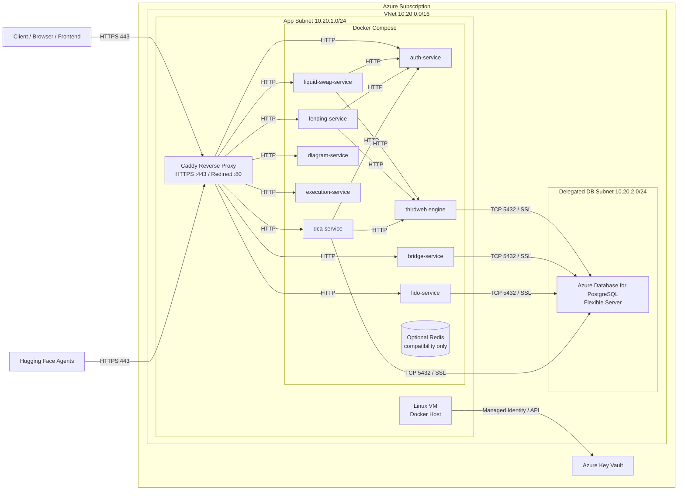

# Panorama Azure VM Backend Architecture

## Scope

This design replaces the current Azure Container Apps deployment with a single Azure Linux VM running Docker Compose. It keeps Azure Database for PostgreSQL as a managed service, keeps Azure Key Vault for secret storage, and uses Caddy on the VM for HTTPS termination and reverse proxying.

### Assumptions

- Environment is `dev` or `test`, not a high-availability production platform yet.
- Traffic is low enough for one VM to be acceptable.
- Backend services are containerized already and published to GHCR.
- External Hugging Face agents remain outside Azure and call the public HTTPS API.
- A temporary Redis compatibility container may still be required until queue/state code is fully migrated to PostgreSQL or in-memory caching.

## High-Level Design

### Components

- **Linux VM**: Single Docker host. Runs Caddy and all backend containers.
- **Docker Compose**: Orchestrates the API and worker-style services on one host.
- **Caddy**: Terminates TLS on ports `80/443`, redirects HTTP to HTTPS, and forwards requests to localhost-bound containers over HTTP.
- **Azure Database for PostgreSQL Flexible Server**: Cheapest viable managed tier with private access from the VM subnet only.
- **Azure Key Vault**: Source of truth for secrets such as database passwords, RPC keys, JWT secrets, and GHCR credentials.
- **VNet/Subnets/NSG/Public IP**: One app subnet for the VM, one delegated database subnet for PostgreSQL, static public IP for inbound HTTPS.

### HTTPS Termination Strategy

Caddy runs directly on the VM host, not as a public cloud load balancer. It listens on ports `80` and `443`, obtains and renews certificates with Let's Encrypt, and proxies to services bound to `127.0.0.1`. That keeps every application container private while still exposing a single public HTTPS endpoint.

### Redis Replacement Strategy

Redis is removed as a managed Azure dependency because Azure Cache for Redis is expensive relative to this project stage. The target approach is:

- Use in-process memory caches for short-lived lookups.
- Use PostgreSQL tables for durable queues, job state, and scheduling metadata.
- Keep an **optional** local Redis container only for compatibility with services that cannot be migrated immediately.

This keeps the steady-state Azure bill low while still giving a migration bridge if one or two services still hard-depend on Redis.

### Cost vs Reliability Trade-Offs

- **Cost win**: one small VM and one small PostgreSQL server are much cheaper than multiple always-on Container Apps revisions plus a managed Redis tier.
- **Reliability loss**: the VM is a single point of failure. A host crash or bad deployment can take down the entire backend.
- **Operational simplicity win**: one deployment target, one reverse proxy, one Compose stack, and one CI/CD flow.
- **Security compromise kept reasonable**: only `80/443` are exposed publicly, services bind to localhost, PostgreSQL uses private networking, and secrets stay in Key Vault.

## Recommended Azure Pattern

- **Resource Group**: one per environment, for example `rg-panorama-dev`.
- **Region**: one low-cost region close to the team or test users, for example `East US`.
- **VM SKU**: start with `Standard_B1ms`; move to `Standard_B2s` if memory pressure appears.
- **Database SKU**: PostgreSQL Flexible Server `B_Standard_B1ms`, zone redundancy disabled.
- **Disk**: Standard SSD, 64 GiB is usually enough for logs, Docker layers, and temporary deployment files in test environments.

## Mermaid Diagram

## Deployment Summary

1. Terraform provisions networking, VM, PostgreSQL, and Key Vault.
2. Cloud-init installs Docker, Docker Compose, Azure CLI, and Caddy.
3. GitHub Actions builds images and pushes them to GHCR.
4. GitHub Actions reads runtime secrets from Key Vault.
5. GitHub Actions copies the Compose bundle to the VM and runs `docker compose up -d`.
6. Caddy serves all public traffic on HTTPS and forwards to private localhost-bound services.
