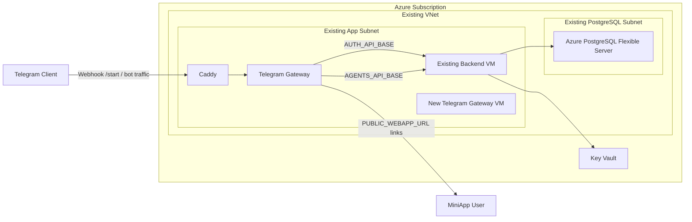

# Panorama Step 1: Telegram Gateway VM Architecture

## Scope

This document defines the first migration step toward a two-VM Azure topology.

- The **current backend VM remains unchanged**.
- A **new second VM** is added for Telegram gateway traffic only.
- The **MiniApp host remains where it is today**.
- Azure Database for PostgreSQL, Key Vault, VNet, and subnets are reused as-is.

## Design Goals

- Add a dedicated failure domain for Telegram bot/webhook traffic
- Keep Terraform changes additive in the current root/state
- Avoid changing already working backend infrastructure
- Keep rollback simple by leaving the existing Azure Container App untouched until cutover is validated

## High-Level Design

### Existing Backend VM

Continues to host the existing API and internal platform services:

- auth-service
- bridge-service
- liquid-swap-service
- lido-service
- lending-service
- dca-service
- diagram-service
- database-gateway
- execution-service
- thirdweb engine

### New Telegram Gateway VM

Hosts only:

- Telegram gateway container
- Caddy for TLS termination and reverse proxy

Does **not** host:

- MiniApp Next.js runtime
- Redis
- PostgreSQL
- backend APIs

### Traffic Shape

- Telegram webhook traffic goes to the new dedicated gateway subdomain
- Gateway auth-proxy requests continue to call the current backend auth API
- `/start` and button flows open the current MiniApp public URL

## Mermaid Diagram

## Terraform Boundary

Step 1 adds only:

- one Azure public IP
- one additional Linux VM
- one additional NIC

Step 1 must not rename, recreate, or update:

- the resource group
- the VNet
- app subnet or PostgreSQL subnet
- the existing backend VM
- PostgreSQL Flexible Server
- Key Vault

## Operational Boundary

- DNS for the dedicated gateway subdomain points to the new VM public IP
- Telegram webhook is switched only after health validation
- Existing Azure Container App remains available as rollback until the VM path is stable
