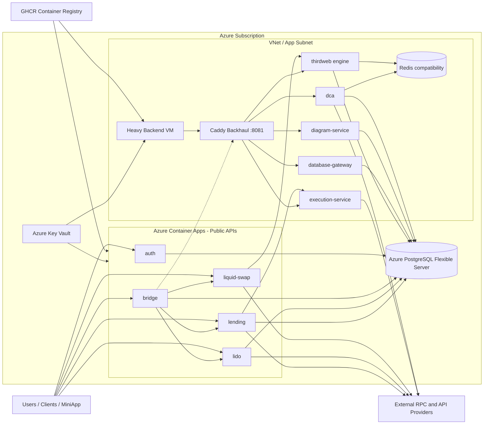

# Panorama Cloud Architecture Overview: Public APIs on ACA

Date: 2026-05-04

## Summary

The target architecture puts public API services on Azure Container Apps and keeps heavier/internal services on a VM Docker Compose runtime. PostgreSQL is the durable data store. Key Vault stores runtime secrets. GHCR stores container images.

This document describes the intended target, not a guarantee that every Terraform or workflow path is already complete.

## Services

| Area | Services | Runtime | Notes |
| --- | --- | --- | --- |
| Public APIs | `auth`, `bridge`, `liquid-swap`, `lido`, `lending` | Azure Container Apps | Public ingress, Key Vault-backed secrets, GHCR images, `/health` probes. |
| Internal/heavy backend | `dca`, `diagram-service`, `database-gateway`, `execution-service`, `thirdweb engine` | Azure VM with Docker Compose | Deployed by `.github/workflows/deploy-vm-backend.yml` using `deploy/azure-vm/docker-compose.heavy.yml`. |
| Compatibility cache | Redis | VM Docker Compose | Treat as cache/compatibility infrastructure, not source of record. |
| Data | Azure PostgreSQL Flexible Server | Managed Azure service | Source of record. Current target uses public network access with firewall rules for ACA reachability. |
| Secrets | Azure Key Vault | Managed Azure service | Canonical secret store for Terraform, ACA, and VM deployment workflows. |
| Images | GHCR | External registry | Images are built by GitHub Actions and pulled by ACA or VM Compose. |

## Data Flow

1. Users and external clients call public ACA endpoints for `auth`, `bridge`, `liquid-swap`, `lido`, and `lending`.
2. ACA pulls service images from GHCR and resolves runtime secrets through Key Vault secret references.
3. Public API services use PostgreSQL over the public Flexible Server endpoint, constrained by firewall rules.
4. `bridge` orchestrates calls to other public APIs. Any direct ACA-to-VM backhaul dependency needs an explicit reachable path; current Terraform does not make private VM backhaul reachable from ACA.
5. Heavy/internal services run on the VM and use Docker Compose, Caddy, Key Vault-rendered `.env.production`, PostgreSQL, Redis, and external RPC/provider APIs.
6. GitHub Actions builds images, pushes them to GHCR, renders VM environment files from Key Vault, and deploys bundles by SSH/SCP for VM workloads.

## Diagram

## Critical Risks

- Database exposure: ACA-to-PostgreSQL uses public network access by decision. Firewall rules must be narrow and reviewed before production.
- Network proof gap: Terraform validation does not prove ACA egress can reach PostgreSQL or that firewall rules match actual ACA outbound IPs.
- Secret proof gap: Terraform reads required Key Vault secrets when ACA is enabled. Missing or misnamed secrets will fail deployment.
- Drift risk: Legacy Container App workflows and Terraform-managed ACA resources can overwrite or disagree with each other.
- VM risk: Heavy/internal services remain on one VM host; host loss affects workers, engine, database gateway, and backhaul.
- SSH exposure: Terraform currently allows inbound SSH from `*`, while security docs warn this should be private or tightly scoped.
- Backhaul reachability gap: The current ACA environment is not VNet-integrated, while VM backhaul `8081/tcp` is intended for app-subnet traffic. If ACA services require VM backhaul, add a deliberate network path before cutover.

## Assumptions

- Public ACA endpoints or DNS aliases become the client-facing API surface after cutover.
- The VM remains available during migration and rollback.
- Redis data is disposable.
- PostgreSQL backups provide the primary data recovery path.
- External RPC and third-party APIs can fail independently and need service-level retries outside this infrastructure document.
