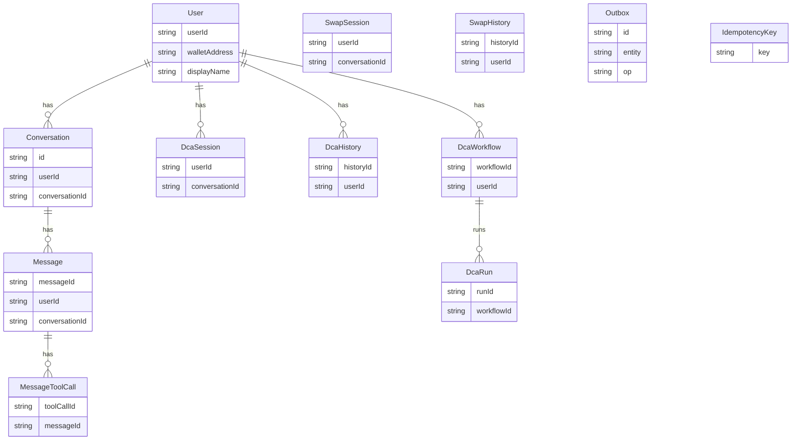
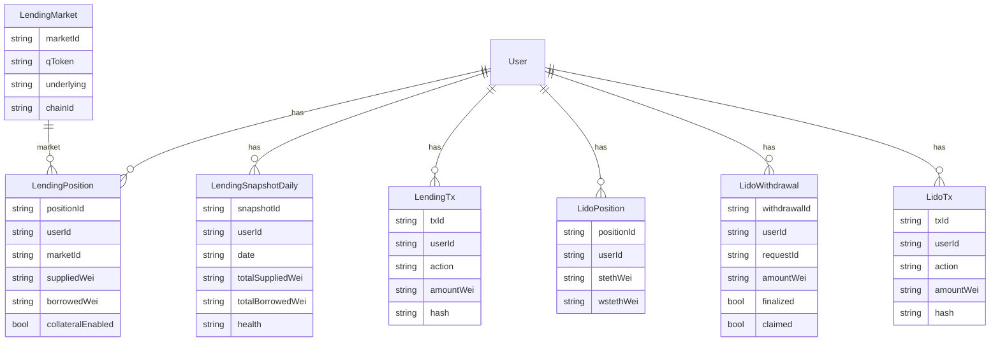

## Lending Service + Data Gateway Analysis (2026-02-08)

Scope:
- Map the current **lending-service** (Benqi + Validation + Trader Joe) APIs.
- Propose **UX/feature coverage**: positions, APY, borrow, repay, redeem, health.
- Analyze the **database gateway** (Prisma) and how to extend it for lending + liquid staking.
- Provide **DB diagrams** (current + proposed).

---

## 1) Lending Service (current state)

**Network:** Avalanche (ChainId 43114).  
**Protocols:** Benqi (lending), Validation contract, Trader Joe (swap), plus validation + swap combos.

**Where it lives:** `panorama-block-backend/lending-service`  
**Entry point:** `index.js` mounts routes:

- `/benqi/*` → lending API (positions + tx prepare)
- `/benqi-validation/*` → combined flows (validation + lending)
- `/validation/*` → validation contract operations
- `/validation-swap/*` → validation + swap
- `/dex/*` → Trader Joe swaps

### Key Benqi endpoints already implemented

**Read (positions / rates / health)**
- `GET /benqi/qtokens` — list supported qTokens.
- `GET /benqi/qtokens/:address` — qToken metadata.
- `GET /benqi/qtokens/:address/rates` — supply/borrow rates (per block + APY).
- `GET /benqi/account/:address/liquidity` — account liquidity + shortfall.
- `GET /benqi/account/:address/assets` — assets in use as collateral.
- `GET /benqi/account/:address/balance/:qTokenAddress` — supplied balance (qToken + underlying).
- `GET /benqi/account/:address/borrow/:qTokenAddress` — borrow balance.
- `GET /benqi/account/:address/info` — aggregates: liquidity + assets + balances + borrow.

**Write (prepare tx)**
- `POST /benqi/supply` — prepare supply tx.
- `POST /benqi/redeem` — prepare redeem tx (withdraw supply).
- `POST /benqi/borrow` — prepare borrow tx.
- `POST /benqi/repay` — prepare repay tx.
- `POST /benqi/enterMarkets` — prepare collateral enable.
- `POST /benqi/exitMarket` — prepare collateral disable.

This already covers “**desfazer posições**”:
- **Close supply**: `redeem` (or `redeemUnderlying`).
- **Close borrow**: `repay`.
- **Disable collateral**: `exitMarket` after borrow is repaid.

---

## 2) Lending UX Model (what we should show)

Benqi is Compound‑style: users deposit assets (receive qTokens), borrow against collateral, interest accrues, and liquidation happens when health drops.

**Recommended UX data:**
- **Positions** (per asset):
  - Supplied (underlying balance)
  - Borrowed (underlying balance)
  - Supply APY / Borrow APY
  - Collateral enabled (entered market)
- **Account health**:
  - Liquidity / shortfall (health factor proxy)
  - Collateral factor (market parameter)
  - Liquidation incentive + close factor (risk)
- **Actions**:
  - Supply / Withdraw (redeem)
  - Borrow / Repay
  - Enable / Disable collateral

This is consistent with a Compound‑style lending model and user expectations.

---

## 3) How to wire the frontend (Telegram Miniapp)

### Read flows (positions & APY)
Use the existing `/benqi` endpoints:

1) **List markets**  
`GET /benqi/qtokens` → list qTokens and underlying.

2) **Rates / APY per market**  
`GET /benqi/qtokens/:address/rates`  
Use `supplyRateAPY`, `borrowRateAPY`.

3) **User positions**  
`GET /benqi/account/:address/info`  
This already aggregates:
  - liquidity/shortfall  
  - assetsIn  
  - qTokenBalances (supply)  
  - borrowBalances  

### Write flows (tx prep + execute)
Same pattern used for Lido:
- Prepare tx via lending-service endpoint.
- Execute tx via Thirdweb wallet.
- Submit hash to backend (optional for analytics).

**Critical**: enforce wallet address == JWT address (same fix we made in staking).

---

## 4) Data Gateway (Prisma) – current scope

The database gateway is a separate service with generic CRUD over Prisma models and enforces:
- Tenancy (`x-tenant-id`)  
- Idempotency keys  
- Outbox for reliable async processing  

It already contains **lending + Lido** models in Prisma and entity configs, but the feature services are not yet consistently **writing snapshots/tx history** into the gateway.

**Add new entity configs here:**  
`panorama-block-backend/database/packages/core/entities.ts`

**Add Prisma models here:**  
`panorama-block-backend/database/prisma/schema.prisma`

---

## 5) Proposed DB extensions (Lending + Liquid Staking)

### Minimal additions for Lending
- **LendingMarket**: qToken, underlying, rates, collateral factor, oracle price.
- **LendingPosition**: per user + market (supplied, borrowed, collateralEnabled).
- **LendingSnapshotDaily**: user-level totals (supplied/borrowed/health) per day.
- **LendingTx**: tx hash, action type (supply/redeem/borrow/repay/enter/exit), amount, status.

### Minimal additions for Liquid Staking
- **LidoPosition**: stETH/wstETH balances, APY snapshot.
- **LidoWithdrawal**: requestId, amount, finalized/claimed.
- **LidoTx**: stake/unstake/claim tx history.

These models let you:
- show positions without repeatedly hitting on-chain,
- reconcile tx state,
- compute PnL/returns,
- power history, activity, and notifications.

---

## 6) DB Diagrams

### 6.1 Current Gateway Schema (Prisma)

### 6.2 Proposed Extensions (Lending + Liquid Staking)

---

## 7) Next execution plan (if you confirm)

1) **Normalize lending reads** for the frontend:
   - Add `GET /benqi/markets` (or similar) returning a stable payload for UI (qToken + underlying + decimals + APY + risk params).
   - Add `GET /benqi/account/:address/positions` returning per‑asset supplied/borrowed/collateralEnabled + a simple health summary.
2) **Implement ingestion**:
   - lending-service + lido-service push txs/snapshots to the DB gateway after each action (idempotent).
3) **Frontend**:
   - Lending component consumes the normalized endpoints for positions.
   - Portfolio page shows “Wallet vs Positions” clearly (no mock data).

---

## 8) Lending improvements plan (recommended)

**API / Service**
- Add a dedicated endpoint: `GET /benqi/account/:address/positions` that returns a normalized payload (per‑asset supply/borrow/APY/collateralEnabled) so the frontend doesn’t need to compose multiple calls.
- Add a cached **markets + rates** endpoint with TTL (30–60s) to reduce RPC load.
- Return **health factor** computed from liquidity/shortfall to keep UI simple.
- Add `prepareValidated*` flows (supply/borrow/repay/redeem) via the `ValidatedLending` contract for single‑tx UX where possible.

**Data / Gateway**
- Ingest **positions snapshots** daily to show earnings/borrow growth.
- Store **tx history** with action, amount, status, hash.
- Build a worker to reconcile pending txs (outbox pattern already supported).

**Frontend / UX**
- Single Lending panel with tabs: **Positions / Borrow / Supply**.
- Show **Health** (liquidation risk) as a simple indicator + tooltip with details.
- “Close position” flow: repay (if any) → disable collateral → redeem.
- Pre‑check gas + amount before opening wallet (same logic as staking).

---

## Sources (external)
None: this doc is derived from the current repo code + standard lending UX patterns for Compound‑style protocols.
