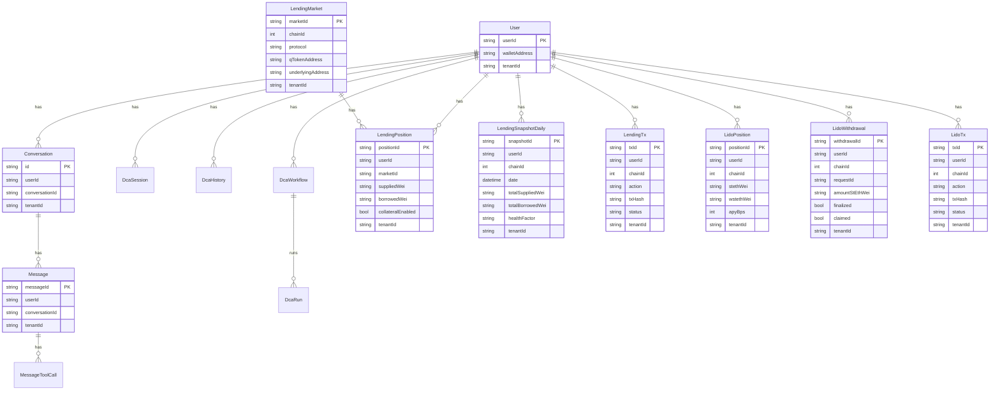
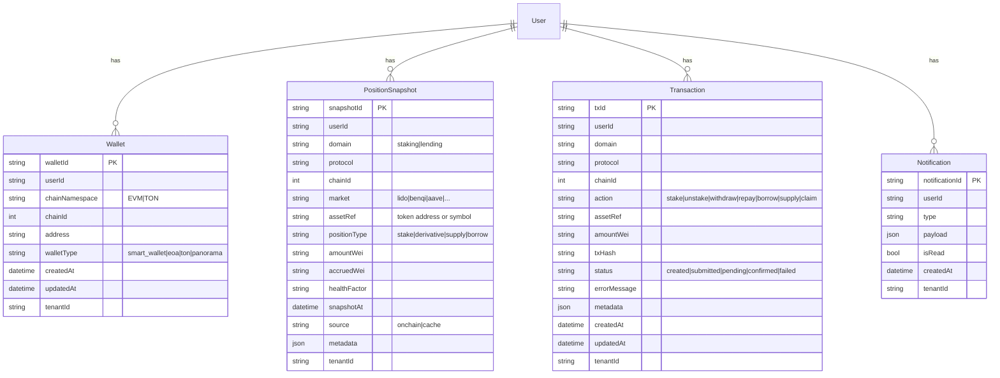
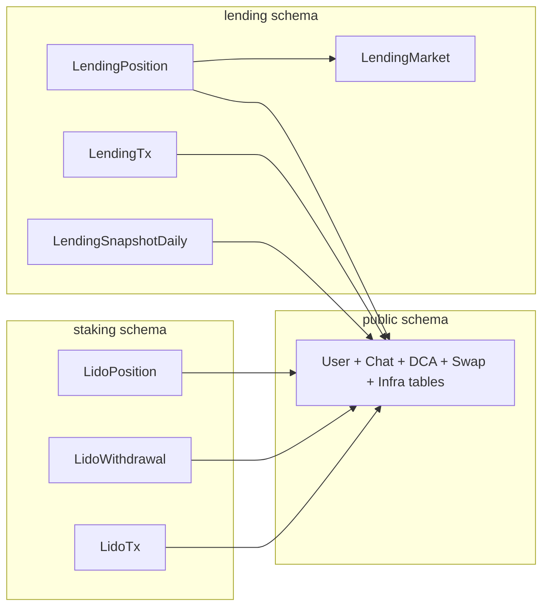

# PanoramaBlock — DB Modeling Diagrams (Current + Target)

Date: 2026-02-10

This document focuses on the **DB gateway** (`panorama-block-backend/database`) and the models that matter for **staking + lending** in v1, plus the recommended “standardized” target for when we add more protocols.

Key constraints (from product):
- `protocol` should be a **string** (future-proof).
- Naming should match existing Prisma style (PascalCase models, camelCase fields, `createdAt/updatedAt`, `tenantId`).
- In the future we want Postgres schemas named `staking` and `lending`.

---

## 1) Two meanings of “schema”

1) **Postgres schemas**: namespaces like `public.*`, `staking.*`, `lending.*`  
2) **Prisma schema**: the single `schema.prisma` file defining models

You can standardize **domain naming today** (Prisma models + fields) and move to **Postgres schemas later** with a controlled migration (Prisma multi-schema).

---

## 2) Current Prisma models (high-level ERD)

Source: `panorama-block-backend/database/prisma/schema.prisma`

This is intentionally not “every column”; it’s the **relationship map**.



Observation:
- v1 already has **protocol-specific tables** for lending + Lido. That’s good for shipping quickly and keeping logic simple.

---

## 3) Target “standardized” model (recommended once we have multiple protocols)

When we add more staking providers and more lending providers, protocol-specific tables tend to multiply quickly.

At that point, we standardize into a small set of generic tables.



Notes:
- `protocol` remains **string**.
- Protocol-specific extras (Lido withdrawal request IDs, Benqi markets entered, etc) stay in `metadata` until we truly need hard columns.

---

## 4) Standardizing into Postgres schemas `staking` / `lending`

This is a **migration**, not a refactor-in-place:

1) v1: keep tables in `public` (ship fast, fewer moving parts)
2) v1.1+: move tables into `staking.*` and `lending.*`
   - requires Prisma multi-schema
   - requires migration scripts + careful rollout

This is worth doing once the v1 product is stable and we have 2+ protocols per domain.

---

## 5) What moves where (concrete mapping)

Today these models live in `public` (default Postgres schema) because the Prisma datasource has no explicit `schemas = [...]`.

**Keep in `public`:**
- Chat/agent core: `User`, `Conversation`, `Message`, `MessageToolCall`, `AgentTurn`, `AgentSharedState`, `ConversationMemory`
- Swap/DCA: `SwapSession`, `SwapHistory`, `DcaSession`, `DcaHistory`, `DcaWorkflow`, `DcaRun`
- Infra: `Outbox`, `IdempotencyKey`

**Move to Postgres schema `staking`:**
- `LidoPosition`
- `LidoWithdrawal`
- `LidoTx`

**Move to Postgres schema `lending`:**
- `LendingMarket`
- `LendingPosition`
- `LendingSnapshotDaily`
- `LendingTx`

Rationale:
- keeps “core product” (chat/agent) stable in `public`
- isolates DeFi domain tables for future migrations / archiving / permissions
- matches your future roadmap (“add more staking and lending providers”)

Visual map:



---

## 6) Prisma multi-schema (how we implement safely)

### 6.1 Prisma schema changes (no data move yet)

In `panorama-block-backend/database/prisma/schema.prisma`:

1) Add the schemas list to the datasource:

```prisma
datasource db {
  provider = "postgresql"
  url      = env("DATABASE_URL")
  schemas  = ["public", "staking", "lending"]
}
```

2) Annotate the moved models:

```prisma
model LidoPosition {
  // fields...
  @@schema("staking")
}

model LendingMarket {
  // fields...
  @@schema("lending")
}
```

Notes:
- With Prisma v5.x, multi-schema is supported; if your Prisma version ever requires it, you may need `previewFeatures = ["multiSchema"]` in the generator, but **avoid enabling preview** unless Prisma forces it.
- Cross-schema relations are valid in Postgres (e.g. `staking.LidoPosition.userId` → `public.User.userId`) and Prisma supports them when multi-schema is enabled.

### 6.2 The data migration (move tables without dropping)

The risky failure mode is Prisma generating a “drop + recreate” when it sees schema changes.
We avoid that by **owning the migration SQL** for the schema move.

Migration strategy:
1) Create schemas (idempotent):
```sql
CREATE SCHEMA IF NOT EXISTS staking;
CREATE SCHEMA IF NOT EXISTS lending;
```

2) Move tables (preserves data + indexes + constraints):
```sql
ALTER TABLE public."LidoPosition"    SET SCHEMA staking;
ALTER TABLE public."LidoWithdrawal"  SET SCHEMA staking;
ALTER TABLE public."LidoTx"          SET SCHEMA staking;

ALTER TABLE public."LendingMarket"        SET SCHEMA lending;
ALTER TABLE public."LendingPosition"      SET SCHEMA lending;
ALTER TABLE public."LendingSnapshotDaily" SET SCHEMA lending;
ALTER TABLE public."LendingTx"            SET SCHEMA lending;
```

3) Confirm:
- the foreign keys still point to `public."User"` correctly
- the Prisma client reads/writes successfully through the gateway

### 6.3 DATABASE_URL gotcha (search_path)

Your gateway README currently shows a connection string with `?schema=public`.
That parameter sets the search_path and can hide other schemas.

For multi-schema, prefer:
- remove `?schema=public` from `DATABASE_URL` (recommended), or
- keep it but ensure Prisma is configured with `schemas = [...]` and can still access them (verify in a staging DB).

---

## 7) How this affects services

**Database gateway**
- No change to routes (`/v1/:entity`) or model names.
- Only the underlying table namespace changes.

**Feature services (lido-service / lending-service)**
- If they use the gateway: unaffected (still HTTP calls).
- If they use raw SQL: any direct `FROM "LidoPosition"` must become `FROM staking."LidoPosition"` (or use search_path).

**Frontend**
- Unaffected directly; it consumes feature-service APIs, not DB.
