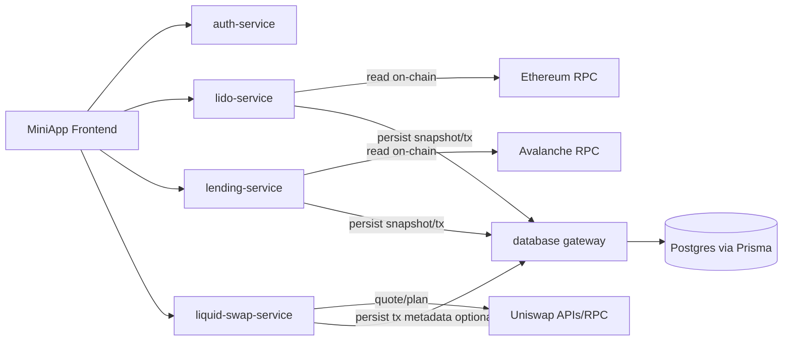
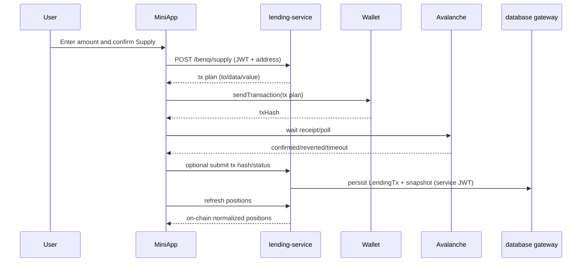

# PanoramaBlock Handoff: Staking + Lending + DB Gateway

Date: 2026-02-17  
Scope: Product + UX + Frontend + Backend + Data layer (Prisma/Gateway)  
Audience: next chat / next engineer picking up execution

## 1) Executive summary

This project has three realities in parallel:

1. Product target is clear: trustworthy positions + safe exits for staking/lending.
2. Frontend evolved quickly (staking/lending flows, tx states, retries, better errors).
3. Data architecture is partially standardized: the `database` gateway is advanced, but `lido-service` and `lending-service` are not fully using it yet.

The correct long-term pattern is:
- on-chain as source of truth for balances/positions;
- `database` gateway as persistence layer for snapshots/history/tx tracking;
- feature services (`lido-service`, `lending-service`) consuming/writing via gateway routes, not raw SQL per service.

## 2) Product context and non-negotiables

Primary goal:
- remove trust friction: user must see what they own and must be able to exit positions safely.

In-scope now:
- Staking (Lido): stake, unstake (queue and market), claim, position visibility.
- Lending (Benqi): supply, borrow, withdraw/redeem, repay, position visibility, health/risk.

Non-negotiables:
- No silent failures.
- No stale quote persistence (no localStorage/DB quote cache).
- Clear wallet state mapping (awaiting wallet, pending on-chain, confirmed, failed, timeout).
- Authentication/JWT present end-to-end.
- Network correctness:
  - staking/swap on Ethereum where required,
  - lending on Avalanche (43114), with explicit chain switching UX.

## 3) Current architecture (real code state)

## 3.1 Frontend (Telegram MiniApp)

Key areas:
- `telegram/apps/miniapp/src/components/Staking.tsx`
- `telegram/apps/miniapp/src/components/Lending.tsx`
- `telegram/apps/miniapp/src/features/staking/api.ts`
- `telegram/apps/miniapp/src/features/lending/api.ts`
- `telegram/apps/miniapp/src/shared/utils/evmReceipt.ts`

Current behavior (high level):
- Uses Thirdweb connected account for signing/sending tx.
- Uses JWT from local storage (`authToken`) for authenticated backend requests.
- Has explicit tx stages (`awaiting_wallet`, `pending`, `confirmed`, `failed`, `timeout`) for both staking and lending.
- Lending API already includes rate-limit and timeout-specific handling for `/benqi/markets`.

## 3.2 Backend services

- `auth-service` validates SIWE/JWT.
- `liquid-swap-service` handles quotes and tx planning for market routes.
- `lido-service` handles staking/unstake/claim and uses direct Postgres (`pg`) + `schema.sql`.
- `lending-service` handles Benqi reads and tx prep (Express), currently mostly stateless/on-chain.

Important:
- `lending-service` has JWT support in `verifySignature` middleware and enforces address match.
- Some GET endpoints historically used request-body assumptions (`req.body`) and caused regressions in specific paths.

## 3.3 Database gateway (`database/`)

Implemented and production-capable foundation:
- Fastify + Prisma gateway with generic CRUD:
  - `/v1/:entity`, `/v1/_transact`
- JWT auth plugin + tenant enforcement (`x-tenant-id` or tenant claim)
- idempotency store
- outbox writes on mutations

Files:
- `database/apps/gateway/src/http/app.ts`
- `database/apps/gateway/src/http/handlers/crud.ts`
- `database/apps/gateway/src/http/middlewares/tenant.ts`
- `database/packages/auth/index.ts`
- `database/packages/core/entities.ts`
- `database/prisma/schema.prisma`

## 4) DB, Prisma, migrations: how it works today

Current facts:

1. Prisma schema includes core chat/agent models + DCA + lending + lido models.
2. Entity registry includes `lending-*` and `lido-*` collections.
3. Migration history in repo currently shows:
   - `20240520120000_init_gateway`
   - `20251027215638_add_dca_tables`
4. Those migrations create core + DCA tables, but do not show lending/lido table creation SQL.

Implication:
- There is schema/migration drift risk.
- A fresh DB from migrations alone may not have lending/lido tables unless another migration is created/applied.

## 5) Why the recommended pattern is DB Gateway-first

Current anti-pattern:
- each service owns SQL and schema init (`lido-service/schema.sql` etc.).

Problems:
- duplicated persistence logic;
- inconsistent naming/constraints between domains;
- harder tenant/auth consistency;
- migration drift and operational risk.

Recommended pattern:
- services keep protocol logic;
- all persistence goes through `database` gateway routes (or shared SDK calling gateway);
- Prisma schema + migrations centralized in one place.

This gives:
- one migration pipeline;
- one auth/tenant model;
- one audit/idempotency/outbox strategy.

## 6) Target architecture (staking/lending with gateway)



Source of truth policy:
- balances/positions = on-chain adapters;
- DB = snapshots/history/notifications/support/audit.

## 7) Canonical domain model (gateway)

Use existing gateway models and normalize naming around two domains:

- Lending:
  - `LendingMarket`
  - `LendingPosition`
  - `LendingSnapshotDaily`
  - `LendingTx`
- Staking:
  - `LidoPosition`
  - `LidoWithdrawal`
  - `LidoTx`

Important: keep amounts as `string` base units (wei/raw), format only in frontend.

## 8) Auth/JWT and tenancy standard

All app flows should follow this:

1. Frontend authenticates via `auth-service` and gets JWT.
2. Frontend calls feature services with `Authorization: Bearer`.
3. Feature service validates JWT and enforces `requested address == token address`.
4. Feature service calls DB gateway with service JWT (service-to-service), passing tenant.

Do not rely on anonymous DB writes from feature services.

## 9) Known incidents captured in this cycle

1. Staking tx UX mismatch vs wallet state:
- wallet confirmed tx/approval while UI showed unknown error or stale pending.
- claim failures returned generic internal error.

2. Lending instability:
- `/benqi/markets` intermittent 500/429/timeout.
- account positions route regressions in some revisions (`req.body` assumptions on GET).
- UI initially diverged from staking pattern and lacked clear tx lifecycle mapping.

3. Operational:
- Compose/env issues (missing vars), DB bootstrap role issues in bridge stack.
- temporary Docker registry/network resolution failures.

## 10) Immediate engineering priorities (ordered)

1. Migration integrity:
- add and apply migration that materializes lending/lido tables present in `schema.prisma`.
- run `prisma migrate deploy` end-to-end in local compose.

2. Service persistence refactor:
- lido-service: replace direct SQL repository writes with gateway writes (or dual-write temporarily).
- lending-service: persist positions/tx snapshots via gateway.

3. Lending reliability:
- harden `/benqi/account/:address/positions` and all GET endpoints to avoid body destructure assumptions.
- ensure markets endpoint has bounded latency and sane cache/rate limiting.

4. Frontend consistency:
- keep staking and lending tx state machines aligned.
- always map wallet outcomes into user-readable states:
  - rejected in wallet
  - likely-to-fail blocked
  - submitted pending
  - confirmed
  - timeout (submitted but no receipt yet)

5. Wallet/network:
- lending must enforce Avalanche chain switch before tx execution.
- execution must use connected Thirdweb app wallet/session path, not ad-hoc provider popups.

## 11) End-to-end flow (supply example)



## 12) Test checklist before new frontend validation

Backend:
- `curl http://localhost:3006/health`
- `curl http://localhost:3006/benqi/markets`
- `curl http://localhost:3006/benqi/account/<addr>/positions` with JWT header

Gateway:
- `curl http://localhost:8080/health`
- validate CRUD on `lending-markets` and `lido-positions` with service token + tenant

Frontend:
- load `/miniapp/lending` without 429 timeout UX break
- execute small supply on Avalanche
- verify tx state transitions and scanner link
- refresh and verify non-zero supplied position

## 13) Open risks

1. Schema drift until lending/lido migrations are committed/applied.
2. Mixed persistence pattern until lido/lending are fully gateway-driven.
3. JWT model split (user JWT vs service JWT) must be explicit to avoid unsafe shortcuts.
4. On-chain read failures (RPC/provider) still need retry and fallback strategy per endpoint.

## 14) Suggested next-chat bootstrap prompt

Use this prompt in a new chat to continue without losing context:

```text
Continue from STAKING_LENDING_DB_HANDOFF_2026-02-17.md.
Priority:
1) Make lending/staking persistence fully gateway-based (no direct SQL in services),
2) close Prisma migration drift for lending/lido tables,
3) keep frontend staking/lending tx state synchronized with wallet and chain receipts,
4) validate end-to-end with one supply, one withdraw/repay, one stake, one claim flow.
Show exact file edits and a runnable local test checklist.
```

## 15) Related docs already in repo

- `panorama-block-backend/LENDING_AND_DB_ANALYSIS.md`
- `panorama-block-backend/STAKING_LENDING_POSITIONS_EXIT_V1.md`
- `panorama-block-backend/LOCAL_TEST_RUNBOOK_STAKING_LENDING.md`
- `panorama-block-backend/DB_MODELING_DIAGRAMS.md`
- `panorama-block-backend/STAKING_LENDING_V1_EXECUTION_PLAN.md`

