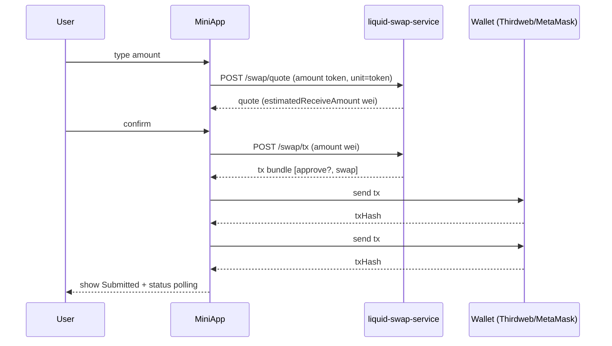

# PanoramaBlock v1 — Staking + Lending (Positions + Safe Exits)

Date: 2026-02-10  
Scope: **Telegram MiniApp + Web** (Thirdweb WaaS)  
Protocols (v1): **Lido (Ethereum Mainnet)** + **Benqi (Avalanche)** + **Market swaps** (ETH↔stETH via `liquid-swap-service`)

This is the **execution plan** (product + UX + engineering) grounded in the current repo.  
Baseline docs:
- Product + architecture overview: `panorama-block-backend/STAKING_LENDING_POSITIONS_EXIT_V1.md`
- Repo call-flow/unit audit: `panorama-block-backend/STAKING_LENDING_CALL_FLOW_AUDIT.md`

---

## 0) The goal (what “done” looks like)

Users can:
1) **See what they own** (Wallet vs Staking vs Lending) with clear source labels.
2) **Exit safely** (Unstake / Withdraw / Repay) with:
   - review screen,
   - clear fees/time warnings,
   - reliable “submitted → confirmed/failed” status,
   - no stale UI state when reopening modals,
   - no quote persistence.

Non-goals for v1:
- USD portfolio totals if price feeds are not reliable.
- PnL / historical yield charts.
- Complex liquidation analytics.

---

## 1) What we change in UX (specific, less jargon)

### 1.1 Staking modal (keep it inside the existing component)

Component: `telegram/apps/miniapp/src/components/Staking.tsx`

**Layout (v1)**
- Tabs:
  - `Stake` / `Unstake`
- Method toggle (same pattern for both tabs):
  - `Protocol (Lido)` vs `Market (Swap)`
- Inputs:
  - `You stake / You unstake` (editable) + `Available` + `Max`
  - `You receive` (read-only)
- “Review” screen (mandatory before opening wallet):
  - amount in/out
  - **# of transactions** (1 vs 2: approval+swap)
  - estimated gas/fees (best effort)
  - time constraint (instant vs queue)
- “Status” screen:
  - Awaiting wallet confirmation
  - Submitted (tx hash link)
  - Confirmed / Failed (with actionable error)

**Copy rules**
- Keep it one line per choice:
  - Stake / Protocol: “Mint stETH via Lido (no slippage).”
  - Stake / Market: “Swap ETH → stETH at current market price.”
  - Unstake / Protocol: “Queue withdrawal (slower, avoids market slippage).”
  - Unstake / Market: “Swap stETH → ETH instantly at market price.”
- Avoid: “fast/standard/queue/instant” as primary labels.
- Keep advanced info behind a single “Advanced” disclosure.

**Hard requirement**
- Errors must not persist when reopening the modal (state reset on open/close).

---

### 1.2 Lending modal (exit-first, positions always visible)

Component (currently incomplete): `telegram/apps/miniapp/src/components/Lending.tsx`

**Layout (v1)**
- Top “Account Health”:
  - Safe / Warning / Risk (derived from Benqi liquidity/shortfall)
- Positions list (per asset):
  - Supplied (token amount)
  - Borrowed (token amount)
  - Collateral enabled (yes/no)
  - Supply APY / Borrow APY (if reliable)
- CTAs:
  - `Withdraw` (only if supplied > 0)
  - `Repay` (only if borrowed > 0)
- Same 4-step pattern: input → review → confirm → status

**Copy rules**
- Hide protocol terms (“qToken”, “Comptroller”) from UI.
- Show constraints in plain language:
  - “You may need to repay before withdrawing if this asset is collateral.”

---

### 1.3 Portfolio page (split Wallet vs Positions)

Page: `telegram/apps/miniapp/src/app/portfolio/page.tsx`

Add a new section above “Active Positions”:
- `Positions`
  - `Liquid staking` card: stETH/wstETH + pending/claimable withdrawals + CTA to open staking
  - `Lending` card: supplied/borrowed totals (token-only) + health label + CTA to open lending

Keep the existing table as “Wallet balances” (not “positions”).

---

## 2) Engineering decisions (to stop regressions)

### 2.1 Amount unit policy (token vs wei)

This is the #1 regression vector. We standardize it:
- `liquid-swap-service /swap/quote`: **token units by default** unless `unit:"wei"`.
- `liquid-swap-service /swap/tx`: **wei** only.
- `lido-service`: **token units** (human strings).
- `lending-service`: **wei** for tx planners.

Enforcement:
- Frontend `QuoteRequest.unit` is **required** (already done).
- Backend guardrail infers `unit` if omitted (decimal → token, long integer → wei).
- Add a “unit audit” checklist for every new call-site.

---

### 2.2 Quotes must be ephemeral (no persistence, no caching)

Frontend:
- No `localStorage` for quotes (keep in component state only).

Backend:
- Quote caching in `liquid-swap-service` is **disabled by default** (both Redis + in-memory maps).
  - Optional override only if explicitly required: `ENABLE_QUOTE_CACHE=true`.
  - Keep token metadata caching OK (that’s not a quote).

Reason: stale quotes create “tx likely to fail”, mismatched approvals, and trust loss.

---

### 2.3 Transaction orchestration + status tracking

We must stop “tx executed but UI shows failure”:
- Create a single FE helper:
  - `extractTxHash(result)` handles Thirdweb return shapes (`transactionHash`, `hash`, nested receipts, string).
  - `executeTxBundle(txs[])` executes sequentially and surfaces which step failed.
- Move status UI to “submitted/pending/confirmed”:
  - Don’t assume “success” at broadcast time.
  - Poll receipt (RPC) or backend `/swap/status/:hash` where available.

---

### 2.4 Local Postgres bootstrap (compose)

For local development, `engine_postgres` runs init scripts **only on first volume init** (when `engine_pgdata` is empty).

Init script (mounted by compose):
- `panorama-block-backend/bridge-service/database/tac-bootstrap.sql`

It creates:
- `tac_service` role + `tac_service` database (used by `bridge_service`)
- `panorama_dca` database (used by `dca_service`)

If you rebuild and remove volumes (e.g., `docker compose down -v`), Postgres will re-run the init script on the next `up`.

---

## 3) Backend contract improvements (minimal, high leverage)

### 3.1 Lending-service normalized endpoints (recommended)

Today, `/benqi/qtokens` + `/account/:address/info` is composable but not FE-friendly.

Add:
1) `GET /benqi/markets`
   - returns per market:
     - qTokenAddress + underlyingAddress
     - underlyingSymbol + decimals
     - supplyAPY + borrowAPY
     - collateralFactor
2) `GET /benqi/account/:address/positions`
   - returns FE-ready per-asset rows:
     - suppliedWei + borrowedWei + decimals + symbol
     - collateralEnabled
   - includes a simple health summary:
     - liquidity/shortfall + label

This reduces client bugs and makes Telegram UX stable.

---

## 4) DB gateway strategy (standardize without thrash)

Current state:
- Prisma already has protocol-specific models:
  - `LidoPosition`, `LidoWithdrawal`, `LidoTx`
  - `LendingMarket`, `LendingPosition`, `LendingSnapshotDaily`, `LendingTx`
  - plus chat/DCA/swap models

User goal:
- standardize “schemas” as `staking.*` and `lending.*` and keep `protocol` as **string**.

Recommended path:
1) **v1:** keep current Prisma models in `public`, but ensure:
   - every table is tenant-scoped (`tenantId` already exists)
   - `protocol` stays string (already)
   - ingestion is consistent (services write txs + snapshots)
2) **v1.1+:** move models into Postgres schemas (`staking`, `lending`) using Prisma multi-schema with a controlled migration.
3) **v2 (optional):** add fully generic tables (`PositionSnapshot`, `Transaction`) once you have 2+ staking providers and 2+ lending providers. Do not force this in v1.

Why: generic schemas are great long-term, but protocol-specific tables reduce v1 risk and ship faster.

---

## 5) Diagrams

### 5.1 System overview (v1)

```mermaid
flowchart LR
  FE[Telegram MiniApp / Web] -->|Bearer JWT| AUTH[auth-service]
  FE -->|Lido reads/plans| LIDO[lido-service]
  FE -->|Quotes + tx bundles| SWAP[liquid-swap-service]
  FE -->|Benqi reads/plans| LEND[lending-service]

  LIDO --> RPC1[(Ethereum RPC)]
  SWAP --> RPC2[(EVM RPCs)]
  LEND --> RPC3[(Avalanche RPC)]

  LIDO --> PG[(Postgres)]
  SWAP --> PG
  LEND --> PG

  subgraph Optional v1 persistence
    DBGW[database gateway (Prisma)] --> PG
    LIDO -.tx/snapshots.-> DBGW
    LEND -.tx/snapshots.-> DBGW
  end
```

### 5.2 Staking (market swap) sequence



---

## 6) Milestones (order matters)

### Milestone 0 — Freeze contracts + remove quote caching
- Disable quote caching in `liquid-swap-service` (redis + in-memory).
- Add/confirm unit policy everywhere (no implicit defaults on FE).

### Milestone 1 — “No more silent failures”
- Centralize tx execution + hash extraction in FE.
- Add submitted/pending/confirmed status tracking.
- Reset modal state on open/close.

### Milestone 2 — Lending positions + exits
- Fix lending FE endpoints (`/benqi/*`, not `/dex/*`).
- Normalize positions payload and render per asset.
- Implement Withdraw/Repay flows with review + status.

### Milestone 3 — Portfolio “Positions” section
- Render staking + lending cards (on-chain truth).
- Add refresh + last-updated.

### Milestone 4 — DB gateway ingestion (optional v1, recommended v1.1)
- Store tx lifecycle + last snapshots for support/debug.

---

## 7) Immediate next decisions (to avoid thrash)

1) Lending v1: do we expose **Supply/Borrow** in UI, or keep v1 as “Positions + Exit only”?
2) Validation contract flows: do we keep “validated” multi-tx flows in v1 UI or hide behind Advanced?
