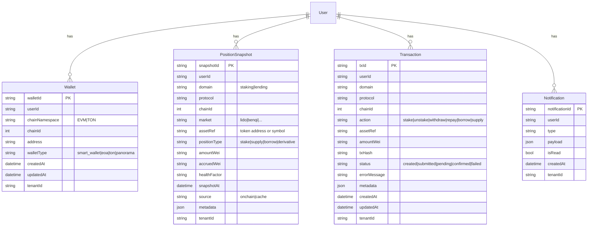

# PanoramaBlock v1: Staking + Lending Positions & Exit Flows

**Scope:** Telegram MiniApp + Web (Thirdweb WaaS)  
**Protocols (v1):** Lido (Ethereum Mainnet) + Benqi (Avalanche) + Uniswap market swaps (ETH↔stETH) via `liquid-swap-service`  
**Goal:** Remove the #1 trust blocker: users must **see what they own** (wallet + positions) and **exit safely** (unstake / withdraw / repay) with clear UX and reliable status updates.

---

## 0) Principles (non-negotiable)

1) **Source-of-truth is on-chain.** DB is cache/history/support, not truth.  
2) **No silent failures.** Every error is actionable, in English, and keeps user context.  
3) **Quotes are ephemeral.** No persistence to `localStorage` / DB; no long TTL caches for quotes.  
4) **One wallet reality.** If JWT-authenticated address ≠ connected wallet address, block execution with a clear fix.  
5) **Exit-first UX.** Every position view must surface the safest “exit” action with a review screen.

---

## 1) Current system map (grounded in repo)

### 1.1 Frontend (Telegram MiniApp)

- **Staking modal (current home for liquid staking):** `telegram/apps/miniapp/src/components/Staking.tsx`  
  - Reads: `useStakingData()` → `telegram/apps/miniapp/src/features/staking/useStakingData.ts`  
  - Writes (Lido protocol): `useStakingApi()` → `telegram/apps/miniapp/src/features/staking/api.ts`  
  - Market quote + tx plan: `swapApi` → `telegram/apps/miniapp/src/features/swap/api.ts`
- **Lending modal (exists but still incomplete):** `telegram/apps/miniapp/src/components/Lending.tsx`
- **Portfolio page (wallet balances already):** `telegram/apps/miniapp/src/app/portfolio/page.tsx`

### 1.2 Backend services (already in compose)

- **Auth:** `panorama-block-backend/auth-service`  
  - Used by staking + swap services via JWT validation.
- **Liquid staking (Lido):** `panorama-block-backend/lido-service`  
  - `GET /api/lido/position/:address` (position)  
  - `GET /api/lido/withdrawals/:address` (queue requests)  
  - `POST /api/lido/stake` (prepared tx)  
  - `POST /api/lido/unstake` (approval or withdrawal request tx)  
  - `POST /api/lido/withdrawals/claim` (claim tx)  
  - `POST /api/lido/transaction/submit` (record tx hash)
- **Market swap (Uniswap Trading API via router):** `panorama-block-backend/liquid-swap-service`  
  - `POST /swap/quote` (**amount default = token units**)  
  - `POST /swap/tx` (**amount = wei**) returns tx bundle (approval + swap)
- **Lending (Benqi):** `panorama-block-backend/lending-service`  
  - `GET /benqi/qtokens`  
  - `GET /benqi/account/:address/info` (positions summary)  
  - `POST /benqi/supply|redeem|borrow|repay` (tx plans)  
  - `POST /benqi-validation/*` (validation + benqi multi-tx plans)

### 1.3 Data gateway (Prisma “DB gateway”)

- Service: `panorama-block-backend/database` (Fastify + Prisma)  
- Entity registry: `panorama-block-backend/database/packages/core/entities.ts`  
- Prisma schema: `panorama-block-backend/database/prisma/schema.prisma`  
- Purpose: central CRUD + idempotency + outbox, so feature services don’t need raw SQL.

---

## 2) Product definitions (what users should understand)

### 2.1 Wallet vs Positions

- **Wallet balance:** tokens spendable in the connected wallet (EVM / smart wallet).  
- **Positions:** assets deployed into protocols:
  - **Liquid staking:** user holds `stETH`/`wstETH` which rebases or tracks staked ETH.
  - **Lending:** supplied + borrowed balances inside Benqi.

### 2.2 Stake / Unstake methods (business + usability)

#### Stake ETH → stETH
- **Protocol (Lido mint):** deposit ETH into Lido and receive `stETH` minted.  
  - Pros: deterministic mint (no DEX slippage), “canonical” staking path.  
  - Cons: you still pay gas; market might offer a better price at times.
- **Market (swap):** swap ETH → stETH on a DEX route.  
  - Pros: can be **better** than 1:1 if stETH trades at a discount.  
  - Cons: slippage + router fees; price can be worse than mint.

#### Unstake stETH → ETH
- **Protocol (withdrawal queue):** request withdrawal via Lido queue and claim later.  
  - Pros: avoids market slippage; typically closer to “fair” exit.  
  - Cons: takes time; usually requires a later **claim** action.
- **Market (instant swap):** sell stETH → ETH on a DEX route.  
  - Pros: immediate liquidity.  
  - Cons: slippage + router fees; can be worse/better depending on price.

**Key point:** whether you acquired stETH via mint or swap, you still get liquid staking exposure because you hold `stETH`.

---

## 3) UX v1 (what we change, and why)

### 3.1 Portfolio page: make “what I own” obvious

Add a **Positions** section below wallet balances:

1) **Liquid staking card**
   - stETH balance (and wstETH if present)
   - “Withdrawals” status: claimable count + pending count
   - Primary CTA: **Open Liquid Staking**
2) **Lending card**
   - Total supplied / total borrowed
   - Health factor or simple risk label (Safe / Warning / Risk)
   - Primary CTA: **Open Lending**

Each card shows:
- **Source-of-truth label:** “On-chain”  
- **Last updated** timestamp + **Refresh**.

### 3.2 Staking modal: reduce jargon, keep exits safe

Keep staking inside the existing component (modal/panel), not a new route.

UX pattern (applies to all actions):
1) Input (amount + Max + “Available”)  
2) Review (amount, expected receive, fees/time)  
3) Confirm (wallet)  
4) Status (submitted/pending/confirmed/failed) + auto-refresh

Copy simplifications:
- Replace “Fast / Queue / Standard” with:
  - **Market (instant)** and **Protocol (queue)** (unstake)
  - **Protocol (mint)** and **Market (swap)** (stake)
- Add 1-line explanation under method toggle (no deep “Details” wall of text).

### 3.3 Lending modal: mirror the same exit-first flow

v1 lending UX must support:
- View positions (supplied/borrowed per asset)
- Exit actions:
  - **Withdraw** supply (when allowed)
  - **Repay** borrow

Same 4-step pattern (input → review → confirm → status).

---

## 4) Engineering strategy (pragmatic v1)

### 4.1 Source-of-truth hierarchy (v1)

**Wallet balances**
- Primary: Thirdweb SDK (already used in Portfolio)

**Staking positions**
- Primary: `lido-service` on-chain reads (`/api/lido/position/:address`, `/withdrawals/:address`)

**Lending positions**
- Primary: `lending-service` on-chain reads (`/benqi/account/:address/info`)

**DB (gateway)**
- Stores: tx tracking, snapshots for history/support  
- Does **not** decide balances/positions

### 4.2 Amount unit policy (critical to avoid quote bugs)

We must enforce this across the repo:

- `liquid-swap-service /swap/quote`
  - `amount` is **token units** by default (`unit` defaults to `"token"` in backend).
  - If a caller sends wei, it must set `unit: "wei"` (or it will double-convert).
  - Back-compat guardrail: if `unit` is omitted, backend infers `wei` for long-integer amounts.
- `liquid-swap-service /swap/tx`
  - `amount` is **wei** (string bigint).
- `lido-service`
  - `amount` is **token units** (ETH/stETH human decimal string).
- `lending-service`
  - `amount` is **wei** (string bigint) for Benqi tx planning.

This is the #1 place regressions happen; we’ll harden it with a unit-audit + TypeScript helpers.

### 4.3 Quote persistence policy (critical to avoid stale output)

- **Do not** persist swap quotes to:
  - `localStorage` (frontend)
  - DB (gateway)
  - Redis / in-memory quote maps (backend)
- Current implementation: quote caching is disabled by default in `liquid-swap-service`.
  - Override only if explicitly required: `ENABLE_QUOTE_CACHE=true`.

---

## 5) Backend API contract (v1 “thin”)

We can ship v1 without creating a brand-new aggregator service by using existing endpoints, then standardize later.

### 5.1 Read APIs (already exist)

- **Staking position:** `GET /api/lido/position/:address`
- **Withdrawals:** `GET /api/lido/withdrawals/:address`
- **Lending position:** `GET /benqi/account/:address/info`

### 5.2 Write APIs (already exist)

- **Stake (protocol):** `POST /api/lido/stake`
- **Unstake (queue):** `POST /api/lido/unstake`
- **Claim withdrawals:** `POST /api/lido/withdrawals/claim`
- **Swap quote:** `POST /swap/quote`
- **Swap tx plan:** `POST /swap/tx`
- **Benqi tx plans:** `POST /benqi/*` or `POST /benqi-validation/*`

### 5.3 Standardized “future” contract (recommended)

Once v1 is stable, add a small **Positions/Portfolio facade** service:
- `GET /v1/portfolio/summary`
- `GET /v1/positions/staking`
- `GET /v1/positions/lending`
- `POST /v1/tx/*` planners that return a normalized `txPlan[]`

This reduces frontend complexity and makes the chat agent integration straightforward.

---

## 6) DB strategy + standardization (gateway-first)

### 6.1 What we store in v1 (minimum)

1) **transactions**
   - action (stake/unstake/withdraw/repay)
   - chainId
   - protocol (string)
   - asset identifiers
   - amountWei
   - status + error
2) **positions snapshots** (optional in v1, valuable for support)
   - last-known positions (staking + lending)
   - timestamp + block number if available
3) **notifications** (later; not required to ship exit flows)

### 6.2 Schema naming (“staking” + “lending”)

There are two different “schema” concepts:

- **Postgres schemas** (namespaces): `staking.*`, `lending.*`  
  - Great for long-term organization and multi-protocol growth.
- **Prisma model naming** (code-level): `PositionSnapshot`, `Transaction`, etc.  
  - Must match existing naming conventions (camelCase fields, PascalCase models).

**Recommended path:**
1) v1: keep new models in the DB gateway using current Prisma style (public schema), but **prefix the domain in fields** (`domain: "staking" | "lending"`, `protocol: string`).  
2) v1.1+: enable Prisma multi-schema (Prisma 5 supports it behind preview flags) and move tables into Postgres schemas `staking` and `lending` with a controlled migration.

### 6.3 Proposed normalized models (Mermaid ERD)

Notes:
- `protocol` must remain a **string** (per your preference) so we can add protocols without schema changes.
- Protocol-specific fields (e.g., Lido withdrawal queue ids) live in `metadata` until/unless we need hard columns.

---

## 7) Delivery plan (phased, minimal thrash)

### Phase A — Trust baseline (P0)

- Portfolio shows **wallet balances + positions cards** (staking + lending).
- Staking modal:
  - “Available + Max” on stake and unstake
  - Accurate market quotes (no unit confusion)
  - Review + status screens
  - Clear errors (insufficient gas, network mismatch, rejection)

### Phase B — Exit flows (P0)

- Liquid staking:
  - Unstake via market (swap) + via queue
  - Claim finalized withdrawals
- Lending:
  - Withdraw supply (when allowed)
  - Repay borrow
  - Health/risk label

### Phase C — Persistence + support (P1)

- Record tx lifecycle in DB gateway (idempotent writes)
- Optional snapshots for support history
- “Copy debug payload” for support

---

## 8) Acceptance criteria (v1)

**Positions**
- Liquid staking: show stETH/wstETH, withdrawals pending/claimable.
- Lending: show supplied/borrowed per asset + health/risk.

**Exit**
- Unstake works end-to-end (market + queue).
- Lending withdraw works when allowed; repay works.

**Trust/UX**
- No silent failures; all errors actionable.
- No quote persistence.
- Clear “Wallet vs Position” source labels.

---

## 9) Open questions to lock (fast)

1) **USD values in v1?** (Recommend: token-only unless you trust price feeds)  
2) **Partial exits?** (Recommend: allow partial + Max; default to Max)  
3) **Lending validation fee flows:** keep multi-tx (validation + action) or reduce to one tx where possible?
